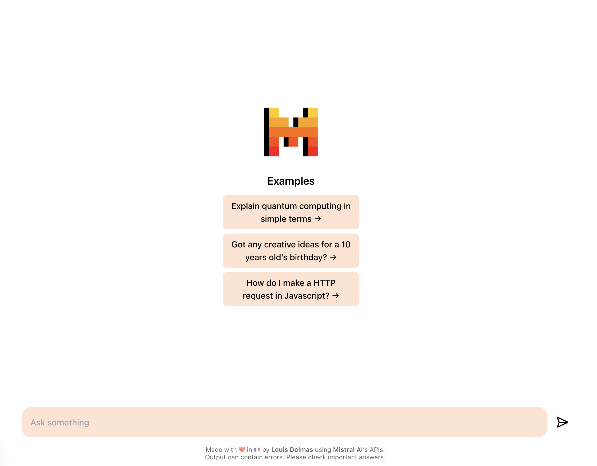

<div style="display: flex; align-items: center; gap: 16px">
    
    <h1 style="border: 0px">Mistral Chat</h1>
</div>

<br />



> A simple chat interface for Mistral AI's language models. Built with Next.js, Tailwind CSS, and the official Mistral AI TypeScript SDK.

_Disclaimer: This project is not production-ready. It is for local use only._

## Key Features

- ✅ **Chat Completion** - Have natural conversations with Mistral AI's language models
- ✅ **Streaming** - See responses appear in real-time as they're generated
- ✅ **Context** - Messages are preserved across the conversation for contextual awareness

## Getting Started

1. Clone this repository:

```bash
git clone https://github.com/delmaass/mistral-chat.git && cd mistral-chat
```

2. Copy `.env` into `.env.local` and set your Mistral AI API Key:

```bash
cp .env .env.local
```

3. Install dependencies & run the development server:

```bash
npm i && npm run dev
```

Open [http://localhost:3000](http://localhost:3000) with your browser to see the result.

## What's next?

- **Join Mistral AI** - Indeed
- **Authentication** - Add user authentication and API key management
- **Context & Server Session** - Persist context with server-side session
- **Conversations** - Persist conversations and switch between them
